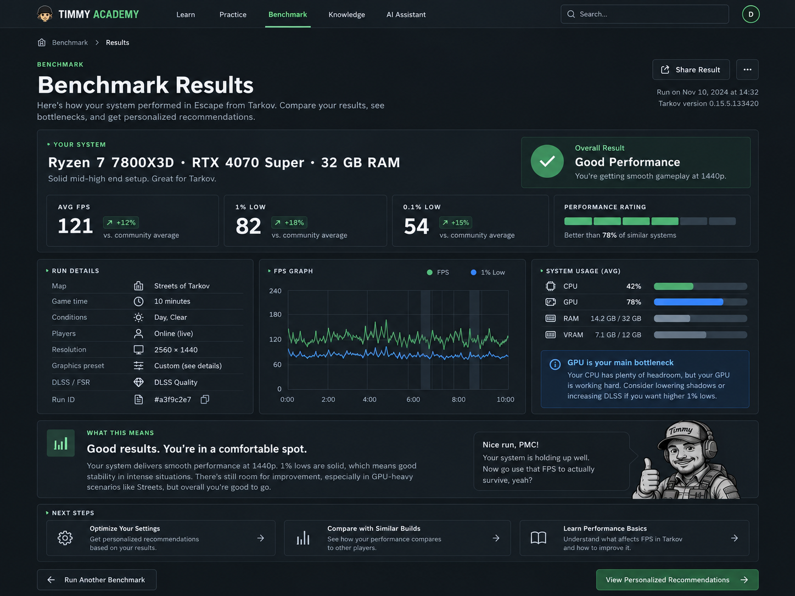

# Timmy Academy — UI Style System v0.1

> Status: exploratory / implementation handoff
> Current direction: **Dark theme only**
> Do **not** implement light/dark theme switching or dual-theme abstractions yet.

## Visual direction

Timmy Academy should feel like a **modern field manual / technical training tool**, not a Tarkov HUD clone.

Core personality:

- Practical
- Calm
- Technical
- Approachable
- Slightly tactical
- Information-first
- Never “military cosplay”

The UI should feel suitable for:

- Lessons
- Practice drills
- Benchmark results
- Knowledge pages
- Skill checks
- AI assistant
- Future progress tracking

Benchmark, lessons, guessers, knowledge map, and AI tools should feel like **different tools from the same product**, not separate mini-sites.

---

## Reference

Dark benchmark result page concept:



Use this as a **visual direction reference**, not as a pixel-perfect implementation spec.

---

# 1. Color system

The dark UI should be based on near-black blue/green neutrals rather than pure black.

## Primitive palette

Suggested starting values:

```ts
const colors = {
  neutral: {
    950: '#0B1115',
    900: '#10181D',
    850: '#142027',
    800: '#19252C',
    700: '#26343D',
    600: '#3A4953',
    500: '#61707A',
    400: '#8C989F',
    300: '#B6C0C5',
    200: '#D3DADD',
    100: '#E9EDEF',
    50:  '#F6F8F8',
  },

  green: {
    950: '#0D2419',
    900: '#123321',
    800: '#18452D',
    700: '#215C3B',
    600: '#2D774C',
    500: '#3E9660',
    400: '#57B978',
    300: '#7ACE96',
    200: '#A8E1B7',
    100: '#D4F1DC',
  },

  blue: {
    800: '#173C63',
    700: '#20558A',
    600: '#2C6FB2',
    500: '#3A86D8',
    400: '#5C9BE1',
    300: '#88B6EA',
  },

  amber: {
    700: '#7A5519',
    600: '#93691E',
    500: '#B48329',
    400: '#D2A44B',
  },

  red: {
    700: '#753833',
    600: '#91463F',
    500: '#B45A50',
    400: '#D3766C',
  },
}
```

Exact values may be tuned during implementation. Preserve the relationships more than the literal hex values.

---

# 2. Semantic tokens

Components should use **semantic tokens**, not primitive colors directly.

```ts
semanticTokens: {
  colors: {
    'bg.canvas':        { value: '{colors.neutral.950}' },
    'bg.surface':       { value: '{colors.neutral.900}' },
    'bg.surfaceSubtle': { value: '{colors.neutral.850}' },
    'bg.elevated':      { value: '{colors.neutral.800}' },

    'fg.default':       { value: '{colors.neutral.100}' },
    'fg.muted':         { value: '{colors.neutral.400}' },
    'fg.faint':         { value: '{colors.neutral.500}' },

    'border.default':   { value: '{colors.neutral.700}' },
    'border.strong':    { value: '{colors.neutral.600}' },

    'brand.default':    { value: '{colors.green.400}' },
    'brand.strong':     { value: '{colors.green.500}' },
    'brand.subtle':     { value: '{colors.green.900}' },

    'action.default':   { value: '{colors.blue.400}' },
    'action.subtle':    { value: '{colors.blue.800}' },

    'success.fg':       { value: '{colors.green.300}' },
    'success.bg':       { value: '{colors.green.900}' },

    'warning.fg':       { value: '{colors.amber.400}' },
    'warning.bg':       { value: '{colors.amber.700}' },

    'danger.fg':        { value: '{colors.red.400}' },
    'danger.bg':        { value: '{colors.red.700}' },
  }
}
```

Rule:

```text
component → semantic token → primitive token
```

Avoid:

```ts
color: '#57B978'
background: '#10181D'
```

Prefer:

```ts
color: 'brand.default'
background: 'bg.surface'
```

---

# 3. Meaning of colors

Do not use green for every interactive element.

Use:

- **Green** → brand, positive result, selected product area, success
- **Blue** → links, actions, informational states, charts
- **Amber** → warning / attention
- **Red** → error / destructive / failed state
- **Gray** → neutral / disabled / locked / metadata

This separation is important for future learning states such as:

- Completed
- Recommended
- Needs work
- Locked
- Optional
- New
- Warning

---

# 4. Typography

Recommended:

- **IBM Plex Sans** — primary UI font
- **IBM Plex Mono** — metrics / technical values

Mono is only for technical/data-oriented content:

- FPS
- 1% lows
- Ammo stats
- Coordinates
- Timestamps
- Hardware values
- IDs

Do not use mono for normal body text.

Suggested styles:

```text
display     36 / 44 / 700
h1          30 / 38 / 700
h2          24 / 32 / 700
h3          20 / 28 / 600

body-lg     17 / 27 / 400
body        15 / 24 / 400
body-sm     14 / 21 / 400

label       13 / 18 / 600
caption     12 / 17 / 400

metric-xl   36 / 40 / 600 mono
metric      20 / 26 / 600 mono
```

Keep the production type scale small. Avoid one-off font sizes.

---

# 5. Signature labels

A recurring Timmy Academy pattern is a small uppercase eyebrow label:

```text
BENCHMARK
YOUR SYSTEM
FPS GRAPH
RUN DETAILS
SYSTEM USAGE
WHAT THIS MEANS
NEXT STEPS
LESSON 04
PRACTICE
HOMEWORK
SKILL CHECK
FIELD NOTE
```

Suggested style:

```text
12–13px
600–700
uppercase
letter-spacing: 0.05–0.07em
```

This is one of the main visual signatures of the product.

---

# 6. Radius

Avoid overly soft SaaS cards.

```text
xs      2px
sm      4px
md      6px
lg      8px
pill    999px
```

Typical usage:

- Cards / panels: 6–8px
- Inputs: 4–6px
- Buttons: 4–6px
- Status chips: pill allowed

---

# 7. Shadows

Use very few shadows.

Hierarchy should come mainly from:

```text
canvas → surface → border → spacing
```

Suggested:

```text
shadow.none
shadow.sm      0 1px 2px rgb(0 0 0 / 0.20)
shadow.overlay 0 12px 32px rgb(0 0 0 / 0.35)
```

Cards generally should not float.

---

# 8. Spacing

Use a 4px base grid.

```text
1  = 4px
2  = 8px
3  = 12px
4  = 16px
5  = 20px
6  = 24px
8  = 32px
10 = 40px
12 = 48px
16 = 64px
20 = 80px
```

Semantic layout examples:

```text
page.x.desktop = 32px
page.x.mobile  = 16px

section.gap  = 48px
card.padding = 20px
field.gap    = 8px

stack.sm = 12px
stack.md = 20px
stack.lg = 32px
```

Avoid arbitrary values such as 17px, 23px, 29px in component layouts.

---

# 9. Surfaces

Do not create a unique card component for every feature.

Use a small surface vocabulary.

## Panel

Default container.

```text
background: bg.surface
border: border.default
radius: lg
```

## Inset

Nested content inside a Panel.

```text
background: bg.surfaceSubtle
border optional
```

## Interactive

Clickable/selectable panel.

States:

```text
default
hover
focus
selected
disabled
```

Selected may use brand border / subtle brand background.

## Callout

Semantic message container:

```text
info
success
warning
danger
```

---

# 10. Buttons

Suggested variants:

```text
primary
secondary
ghost
danger
```

### Primary

Green.

Used for the main action on a page.

Example:

```text
View Personalized Recommendations
Start Practice
Continue Lesson
```

### Secondary

Neutral surface + border.

### Ghost

Navigation / tertiary actions.

### Link action

Blue text, optionally with arrow/icon.

Avoid having multiple primary buttons competing inside one viewport section.

---

# 11. Cards and metrics

Benchmark metrics should use strong hierarchy.

Example:

```text
AVG FPS
121
↗ +12%
vs. community average
```

Recommended:

- label → eyebrow/label style
- primary number → IBM Plex Mono / metric-xl
- delta → semantic success/warning color
- comparison → muted body-sm

Do not encode meaning with color alone.

---

# 12. Charts

Charts should be quiet and technical.

Preferred characteristics:

- dark neutral plot area
- subtle grid
- green primary series
- blue secondary series
- muted axes
- minimal legend
- no gradients unless meaningful
- no decorative chart chrome

Charts should feel like diagnostic tools, not marketing graphics.

---

# 13. Timmy personality

Do not place the mascot everywhere.

Use Timmy primarily where the product is speaking directly to the learner:

- Empty state
- First-run onboarding
- Mistake explanation
- Homework result
- Congratulations
- Difficult lesson warning
- 404
- Benchmark conclusion
- Occasional loading/easter egg

Example:

```text
Nice run, PMC!

Your system is holding up well.
Now go use that FPS to actually survive, yeah?
```

The mascot should add humanity and humor without reducing information density.

---

# 14. Benchmark result page structure

The current result-page concept follows this hierarchy:

```text
Header / navigation

Breadcrumb
Benchmark eyebrow
Page title
Description
Run metadata / share action

System summary panel
  hardware title
  result state
  avg FPS
  1% low
  0.1% low
  comparison / performance indicator

Three-column diagnostics
  Run details
  FPS graph
  System usage + bottleneck callout

Interpretation section
  What this means
  Timmy contextual message

Next steps
  Optimize settings
  Compare similar builds
  Learn performance basics

Footer actions
  Run another benchmark
  Personalized recommendations
```

This information architecture is good and should be preserved unless product requirements change.

---

# 15. Panda CSS organization

Suggested structure:

```text
theme/
  tokens/
    colors
    spacing
    sizes
    radii
    shadows
    fonts

  semanticTokens/
    colors
    borders
    surfaces
    text

  textStyles/
    display
    heading
    body
    label
    metric

  recipes/
    button
    panel
    input
    select
    badge
    callout
    tabs
    tableRow

  slotRecipes/
    card
    field
    statBlock
    lessonCard
```

Prefer reusable recipes over custom styling at feature level.

---

# 16. Implementation rule for current iteration

**Dark theme only.**

Do not currently add:

- theme switcher
- `light` / `dark` component variants
- duplicated light-theme semantic tokens
- runtime theme state
- theme persistence
- OS color-scheme handling

Keep semantic token naming generic enough that a light theme can be introduced later, but do not build the abstraction prematurely.

Example:

Good:

```ts
background: 'bg.canvas'
color: 'fg.default'
```

Avoid:

```ts
background: 'dark.canvas'
color: 'dark.text'
```

This preserves future flexibility without implementing two themes now.

---

# 17. Design principles

When adding a new component, ask:

1. Is this primarily content, action, status, or navigation?
2. Can an existing Panel / Inset / Interactive / Callout surface handle it?
3. Can existing typography styles handle it?
4. Does the color communicate meaning or merely decorate?
5. Does this still look like a training tool?
6. Is any Tarkov flavor subtle enough that the UI remains usable outside that context?
7. Would this component still fit naturally beside benchmark, lessons, and practice tools?

If a component requires many custom visual rules, reconsider whether it belongs in the shared system.

---

## Current visual summary

```text
TIMMY ACADEMY — FIELD MANUAL

Theme
Dark only

Canvas
Near-black blue/green neutral

Surfaces
Dark layered panels
Border-defined
Almost no shadows

Primary accent
Muted fresh green

Actions / information
Blue

Typography
IBM Plex Sans
IBM Plex Mono for technical values

Radius
4–8px

Density
Medium / information-first

Signature
Uppercase eyebrow labels
Mono metrics
Technical diagnostics
Field-note callouts
Contextual Timmy illustrations
```
